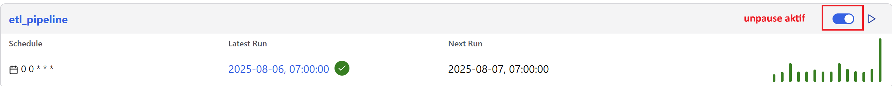
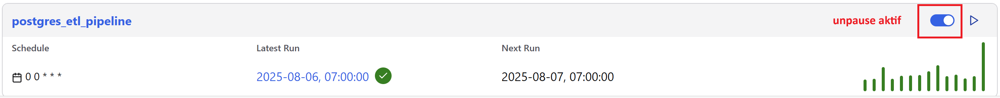

# Getting Started with Apache Airflow

## 📈 Latar Belakang

Data saham menjadi salah satu sumber informasi yang sangat penting bagi analis keuangan, pengembang sistem trading, maupun pelaku bisnis untuk mengetahui kondisi pasar saham setiap harinya. Namun, untuk dapat mengambil keputusan setiap harinya berdasarkan data yang ada, diperlukan proses pengambilan, pengolahan, dan penyimpanan **data yang terstrutur dan otomatis**.

Proses ini biasa disebut sebagai **ETL** (Extract, Transform, Load) yang mana dapat membantu para pengambil keputusan dalam mengambil data dari sumber eksternal, membersihkannya, dan menyimpannya ke dalam sistem penyimpanan terpusat. Kemudian, data saham ini dapat dilakukan analisis lebih lanjut. Dalam proyek ini, saya membangun sebuah ETL pipeline untuk:

1. Mengambil data saham harian dari [Polygon API](http://polygon.io/) (sumber data eksternal).
2. Melakukan transformasi data sesuai dengan format penulisan data yang memiliki standar.
3. Memuat hasil transformasi ke dalam SQLite dan PostgreSQL.

Data saham yang diambil berhasal dari endpoint API yang menyajikan ringkasan harian (Daily Ticker Summary) dengan referensi `ticker` (kode saham) adalah **AMZN** untuk perusahaan Amazon dan referensi `date` adalah tanggal setiap hari mulai dari tanggal **1 Januari 2025**. Selengkapnya dokumen mengenai enpoint API untuk Daily Ticker Summary dapat diakses pada lik berikut [ini](https://polygon.io/docs/rest/stocks/aggregates/daily-ticker-summary).

---

## 🎯 Tujuan

✅ Mengambil data saham dari Polygon API.  
✅ Mengubah data menjadi struktur kolom yang telah ditetapkan.  
✅ Menangani data dari nilai yang hilang.  
✅ Memuat hasil akhir ke dalam SQLite dan PostgreSQL.  
✅ Membuat otomatisasi proses ETL.

--- 

## 🧱 Struktur Output

Masing-masing data yang disimpan dalam database SQLite dan PostgreSQL, selanjutnya di-backup ke dalam direktori lokal `./include/` bardasarkan database:

- [`market_data.db`](#-file-1-market_datadb) ➡️ Data saham di-backup secara otomatis untuk database SQLite.
- [`market_postgres_data.sql`](#-file-2-market_postgres_datadb) ➡️ Data saham di-backup secara manual melalui pgAdmin untuk database PostgreSQL.

---

## 📁 File 1: `market_data.db`

Berisi tabel ringkasan informasi harian harga pembukaan dan penutupan untuk saham Amazon sesuai tanggal dalam format database SQLite.

<details>
<summary><strong> Lihat struktur tabel</strong></summary>

| Kolom         | Tipe Data         | Deskripsi                                                 | Nilai Default               |
|---------------|-------------------|-----------------------------------------------------------|-----------------------------|
| `status`      | `VARCHAR(255)`    | Status tanggapan dari request API                         | `"close"`                   |
| `date`        | `DATETIME`        | Tanggal request yang dilakukan (`"YYYY-MM-DD"`)           | Sesuai tanggal request API  |
| `symbol`      | `VARCHAR(10)`     | Kode saham                                                | `"AMZN"`                    |
| `open`        | `NUMERIC(10, 2)`  | Harga pembukaan saham                                     | `None`                      |
| `high`        | `NUMERIC(10, 2)`  | Harga tertinggi kode saham pada saat tanggal request      | `None`                      |
| `low`         | `NUMERIC(10, 2)`  | Harga terendah kode saham pada saat tanggal request       | `None`                      |
| `close`       | `NUMERIC(10, 2)`  | Harga penutupan saham                                     | `None`                      |
| `volume`      | `INT`             | Volume perdagangan kode saham pada saat tanggal request   | `None`                      |
| `afterHours`  | `NUMERIC(10, 2)`  | Harga penutupan kode saham setelah jam kerja perdagangan  | `None`                      |
| `preMarket`   | `NUMERIC(10, 2)`  | Harga pembukaan kode saham pra-pasar perdagangan          | `None`                      |

</details>

---

## 📁 File 2: `market_postgres_data.db`

Berisi tabel ringkasan informasi harian harga pembukaan dan penutupan untuk saham Amazon sesuai tanggal dalam format database PostgreSQL.

<details>
<summary><strong> Lihat struktur tabel</strong></summary>

| Kolom         | Tipe Data         | Deskripsi                                                 | Nilai Default               |
|---------------|-------------------|-----------------------------------------------------------|-----------------------------|
| `status`      | `VARCHAR(255)`    | Status tanggapan dari request API                         | `"close"`                   |
| `date`        | `DATE`            | Tanggal request yang dilakukan (`"YYYY-MM-DD"`)           | Sesuai tanggal request API  |
| `symbol`      | `VARCHAR(10)`     | Kode saham                                                | `"AMZN"`                    |
| `open`        | `NUMERIC(10, 2)`  | Harga pembukaan saham                                     | `None`                      |
| `high`        | `NUMERIC(10, 2)`  | Harga tertinggi kode saham pada saat tanggal request      | `None`                      |
| `low`         | `NUMERIC(10, 2)`  | Harga terendah kode saham pada saat tanggal request       | `None`                      |
| `close`       | `NUMERIC(10, 2)`  | Harga penutupan saham                                     | `None`                      |
| `volume`      | `INT`             | Volume perdagangan kode saham pada saat tanggal request   | `None`                      |
| `afterHours`  | `NUMERIC(10, 2)`  | Harga penutupan kode saham setelah jam kerja perdagangan  | `None`                      |
| `preMarket`   | `NUMERIC(10, 2)`  | Harga pembukaan kode saham pra-pasar perdagangan          | `None`                      |

</details>

---

## ⚙️ Teknologi

- Integrated Development Environment (IDE)  ➡️ Visual Studio Code
- Distributed Version Control System  ➡️ Git 
- Bahasa Pemrograman ➡️ Python
- Python Library ➡️ apache-airflow, apache-airflow-providers-postgres, apache-airflow-providers-sqlite, pandas, requests, datetime
- ETL Pipeline Orchestrator ➡️ Apache Airflow 3.0
- Relational Database Management System (RDMS) ➡️ SQLite, PostgreSQL
- Containerization Platform ➡️ Docker
- Command Line Interface (CLI) ➡️ Astro CLI
- Operating System ➡️ Linux 

## 📂 Struktur Direktori

```
🗃️ Getting-Started-with-Apache-Airflow
├── dags
|   ├── etl_pipeline.py           # Python script - ETL database SQLite
|   └── postgres_etl_pipeline.py  # Python script - ETL database PostgreSQL
├── docker-compose.yaml       # Docker compose - pgAdmin
├── README.md                 # Deskripsi proyek ini
└── requirements.txt     # Python library dibutuhkan
```

---

## ⚙️ Konfigurasi DAG

Adapun konfigurasi DAG yang perlu dipertimbangkan.

| Parameter                  |Nilai                                             |
|----------------------------|--------------------------------------------------|
| DAG ID                     | Sesuaikan nama Python script                     |
| Start Date                 | 1 Januari 2025 (UTC)                             |
| Interval                   | Harian (`@daily`)                                |
| Catchup?                   | Eksekusi historis sejak 1 Januari 2025 (`True`)  |
| Concurrency                | Diperbolehkan 1 DAG berjalan sekaligus           |
| Task Retries, Retry Delay  | 3 retries dengan jeda 5 menit antar retry        |

---

## 📦 Prasyarat

Sebelum memulai, pastikan sistem sudah memiliki:

| Tools          | Perintah Cek         | Versi Disarankan  |
|----------------|----------------------|-------------------|
| **Python**     | `python3 --version`  | ≥ 3.12            |
| **Git**        | `git --version`      | ≥ 2.43            |
| **Docker**     | `docker --version`   | ≥ 28.x            |
| **Astro CLI**  | `astro version`      | ≥ 1.34            |

---

## 🛠️ Instalasi Manual

### 1. Clone repositori ini

<pre>
git clone https://github.com/mhndra/Getting-Started-with-Apache-Airflow.git
cd Getting-Started-with-Apache-Airflow
</pre>

### 2. (Opsional) Setup Virtual Environment untuk Python

<pre>
python3 -m venv .venv
source .venv/bin/activate  # Linux
pip install -r requirements_venv.txt
</pre>

### 3. Menginisialisasi proyek Astro

<pre>
astro dev init
</pre>

---

## 🧱 Struktur Proyek Astro

Setelah melakukan instalasi manual hingga [Menginisialisasi Proyek Astro](#3-menginisialisasi-proyek-astro), maka struktur direktori menjadi berikut ini.

```
🗃️ Getting-Started-with-Apache-Airflow
├── .astro/
├── dags
|   ├── etl_pipeline.py
|   ├── exampledag.py
|   └── postgres_etl_pipeline.py
├── include/
├── plugins/
├── tests/
├── .dockerignore
├── .env
├── .gitignore
├── airflow_settings.yaml
├── docker-compose.yaml
├── Dockerfile
├── packages.txt
├── README.md
└── requirements.txt
```
---

## 🔌 Membuat Koneksi Masing-Masing RDMS

### 1. Menjalankan proyek Astro di Docker

<pre>
astro dev start
</pre>

### 2. Membuka Apache Airflow 3.0 Web UI

URL untuk Apache Airflow 3.0 Web UI.

http://localhost:8080/

### 3. Membuat koneksi di Apache Airflow 3.0 Web UI

Masuk ke halaman **Admin** --> **Connections**. Kemudian, klik **Add Connection** untuk membuat koneksi masing-masing RDMS.

| Connection ID                  | Connection Type  | Host                                       | Login     | Password  | Port  | Schema                | 
|--------------------------------|------------------|--------------------------------------------|-----------|-----------|-------|-----------------------|
| market_database_conn           | Sqlite           | /usr/local/airflow/include/market_data.db  | -         | -         | -     | -                     |
| market_postgres_database_conn  | Postgres         | postgres                                   | postgres  | postgres  | 5432  | market_postgres_data  |

**Save** untuk menyimpan koneksi.

### 4. Mengakses bash dari PostgreSQL Container

```
docker exec -it <nama_compose_stack>-postgres-1 bash
```

<details>
<summary><strong> Nama compose stack yang diikuti '-postgres-1' dapat dilihat melalui command berikut.</strong></summary>

<pre>
docker ps | grep -- -postgres-1
</pre>`

</details>

### 5. Membuat PostgreSQL Database

<pre>
psql -U postgres
CREATE DATABASE market_postgres_data;
\q
</pre>

<pre>
exit
</pre>

---

## 🐋 Menjalankan Docker Compose

Sebelum menjalankan, pastikan **port 5050** tidak digunakan dan paste nama **network** yang digunakan PostgreSQL Container di `docker-compose.yaml`.

<pre>
docker compose up -d  # jalankan container di latar belakang
</pre>

<details>
<summary><strong> Nama network yang digunakan PostgreSQL Container dapat dilihat melalui command berikut.</strong></summary>

```
docker inspect --format='{{json .NetworkSettings.Networks}}' <nama_compose_stack>-postgres-1
```

**Potongan tampilan** hasil eksekusi command:
```
{"<nama_network_akan_tertampil_disini>":{"IPAMConfig":null,"Links":null,"Aliases":[  # copy nama network
```

</details>

<details>
<summary><strong> Potongan docker-compose.yaml</strong></summary>

```
    volumes:
      - ./include:/var/lib/pgadmin/storage
    networks:
      - <nama_network_yang_digunakan_postgresql_container>  # paste nama network disini
      
networks:
  <nama_network_yang_digunakan_postgresql_container>:  # paste nama network disini
    external: true
```

</details>

---

## 🔌 Mengkoneksikan pgAdmin dengan PostgreSQL Database

### 1. Login pgAdmin

Login menggunakan email address dan password.

| Email Address / Username  | Password        |
|---------------------------|-----------------|
| admin@admin.com           | admin_password  |

### 2. Register Server

Register server PostgreSQL dengan cara klik kanan **Servers** --> **Register** --> **Server...**

<details>
<summary><strong> Tab General</strong></summary>

| Name                  |
|-----------------------|
| market_postgres_data  |

</details>

<details>
<summary><strong> Tab Connection</strong></summary>

| Host name/address                | Port  | Maintenance database  | Username  | Password  |
|----------------------------------|-------|-----------------------|-----------|-----------|
| <nama_compose_stack>-postgres-1  | 5432  | postgres              | postgres  | postgres  |

</details>

**Save** untuk menyimpan. Pastikan register server berhasil yang ditandai nama server dan database muncul dengan cara expand **Servers**.

---

## 💨 Menjalankan Dags

Jalankan **etl_pipeline** terlebih dahulu dengan mengaktifkan **unpause**. Tunggu hingga **Latest Run** di tanggal mengaktifkan **unpause** ini. Reload untuk meng-update tanggal **Latest Run**.  


Setelah selesai, jalankan **postgres_etl_pipeline** dengan langkah yang sama.  


---

## ✅ Query Hasil Menjalankan Dag di pgAdmin

Masukkan query berikut di **pgAdmin** untuk melihat hasil menjalankan dag pada **postgres_etl_pipeline**.

<pre>
SELECT *
FROM market_data;
</pre>

## 💾 Backup PostgreSQL Database

Backup PostgreSQL database dengan cara klik kanan **market_postgres_data** --> **Backup...** --> klik simbol folder (📁)

| Save As               | File Format  |
|-----------------------|--------------|
| market_postgres_data  | sql          |

**Create** --> **Backup** untuk backup. Pastikan berhasil backup PostgreSQL database berhasil yang ditandai struktur direktori lokal (bukan container) memunculkan file `market_postgres_data.sql` dan `market_data.db`.

```
🗃️ Getting-Started-with-Apache-Airflow
└── include
    ├── admin_admin.com
    |   └── market_postgres_data.sql
    └── market_data.db
```

## 📌 Kesimpulan

Dengan proyek ini, saya mempraktikkan pembuatan **ETL pipeline** yang terjadwal dan terkelola dengan baik menggunakan **Apache Airflow 3.0**, serta memperkuat pemahaman terhadap:

- TaskFlow API menggunakan Airflow decorator.
- Integrasi API eksternal (Polygon API) menggunakan requests.
- Transformasi data menggunakan pandas.
- Koneksi ke database SQLite dan PostgreSQL melalui Apache Airflow 3.0.